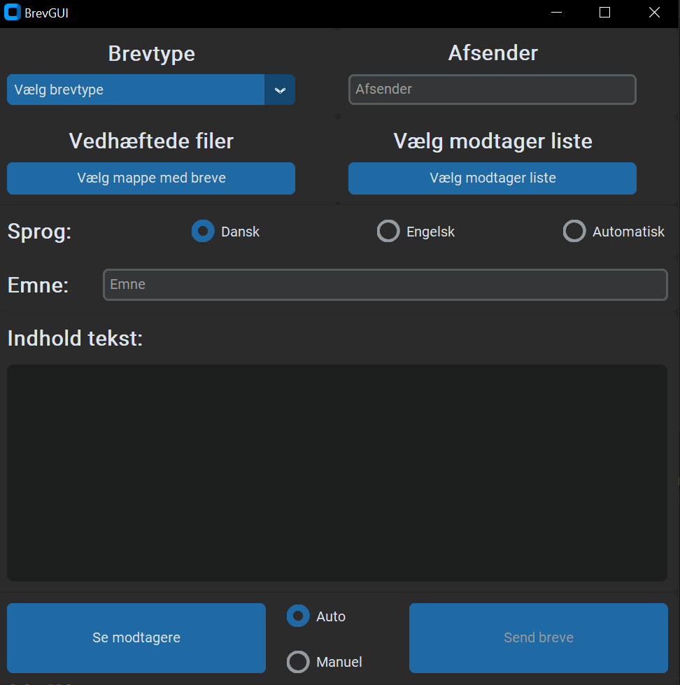
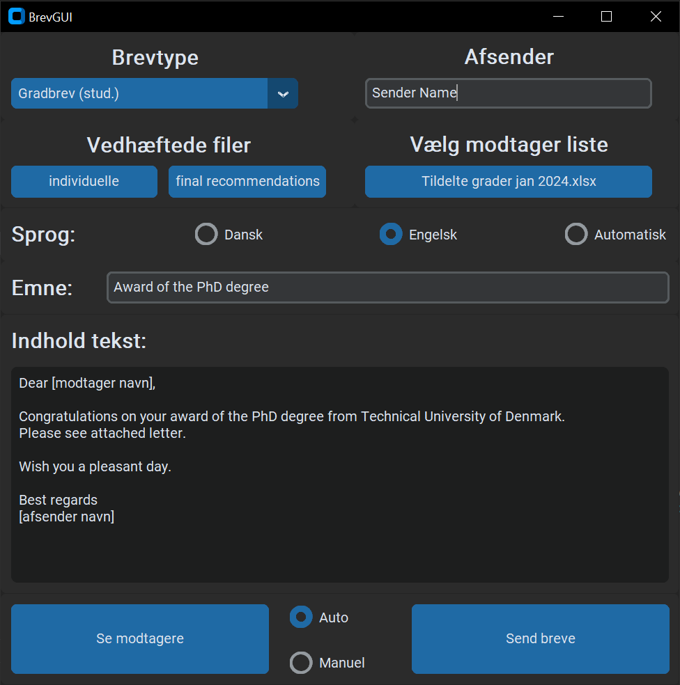

# BrevGUI
A program to automate sending out personalised emails with attachments to individual recipients.

## Preview
Main application:


Main application award of degree preview:



## Build
To build using PyInstaller, see info at [ctk documentation](https://customtkinter.tomschimansky.com/documentation/packaging):

1. Find the install location of the customtkinter library:
```
pip show customtkinter
```
2. add the library folder location, with add-data when calling PyInstaller, like so:
```
--add-data C:/Users/<user_name/AppData&Local/programs/python&python390/lib/site-packages/customtkinter;customtkinter/"
```
3. You **must** use `--onedir` when packaging. The full command will look something like this:
```
pyinstaller --noconfirm --onedir --windowed --add-data "<CustomTkinter Location>/customtkinter;customtkinter/"  "src/BrevGUI.py"
```

Ensure that the following packages are installed when building:
* Pandas `pip install pandas`
* Numpy `pip install numpy`
* Openpyxl `pip install openpyxl`
* CustomTkinter `pip install customtkinter`
* Win32Com `pip install pywin32`

## Notes
- The program needs the .txt files in the content folder, in order to run.
- The program needs the list of secretaries at the institutes in order to run.

## TODO
- Look into automatic mail merging as part of the process [see link](https://pypi.org/project/docx-mailmerge/)
